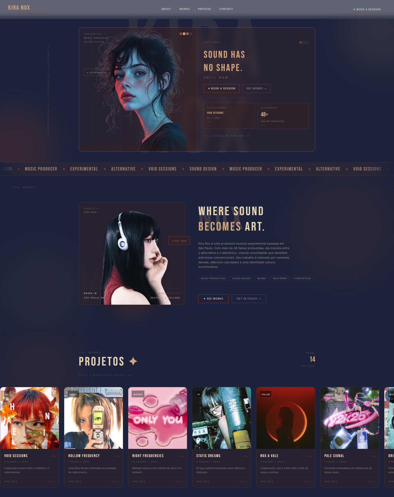

<div align="center">
  
</div>
<div align="center">

  
  [](https://git.io/typing-svg)
  
</div>

## 💜 Sobre mim

Olá! Sou estudante de programação focada em **Desenvolvimento Front-End**. Com uma forte veia artística, adoro transformar ideias em interfaces visuais atraentes e funcionais. Acredito que código e design andam lado a lado, e busco sempre criar experiências que sejam tanto bonitas quanto intuitivas.

```javascript
const erika = {
  pronouns: "ela/dela",
  code: ["JavaScript", "Python", "HTML", "CSS"],
  technologies: {
    frontEnd: {
      js: ["React", "Vite"],
      css: ["Tailwind CSS", "Styled Components"]
    },
    backEnd: {
      js: ["Node.js", "Express"]
    },
    databases: ["MySQL", "MongoDB"],
    tools: ["Git", "GitHub", "VS Code", "Figma"]
  },
  currentlyLearning: ["Full Stack Development", "Data Analysis", "Data Visualization"],
  focus: "Front-End Development com forte senso estético",
  passion: "Unir criatividade artística com código limpo",
  funFact: "Transformo pixels em experiências memoráveis!"
};
```

## 🚀 Tecnologias & Ferramentas

<div align="center">

### Frontend


### Backend & Database


### Tools & Others


</div>

## 📊 GitHub Stats

<div align="center">
  
  
</div>

<div align="center">
  
</div>

## 🎯 Projetos em Destaque

### 🎵 [Kira Nox — Sound Producer Portfolio](https://github.com/erikalaiane/kira-nox)

Portfólio fictício de uma produtora musical experimental com design vintage, glassmorphism, carrosséis animados e loading screen.

[](https://github.com/erikalaiane/kira-nox)


---

### 🏎️ [Acelera Club — Hub de Automobilismo](https://github.com/erikalaiane/acelera-club)

Hub de automobilismo fictício do Rio de Janeiro com simuladores, marketplace, calendário de eventos e sistema de assinatura. Design inspirado em equipes de F1.

[](https://github.com/erikalaiane/acelera-club)


**[🚀 Ver Demo ao Vivo](https://erikalaiane.github.io/acelera-club/)**

## 📫 Contato

<div align="center">

[](https://www.linkedin.com/in/erika-laiane-azevedo)
[](mailto:erikalaianeazevedosantos@gmail.com)
[](https://github.com/erikalaiane)

</div>

## 💡 Frase que me inspira

<div align="center">
  
  ```
  "Programar é arte disfarçada de ciência."
  ```
  
</div>

---

<div align="center">
  
  
  
  
  **Desenvolvido com 💜 por Erika Laiane**
</div>
