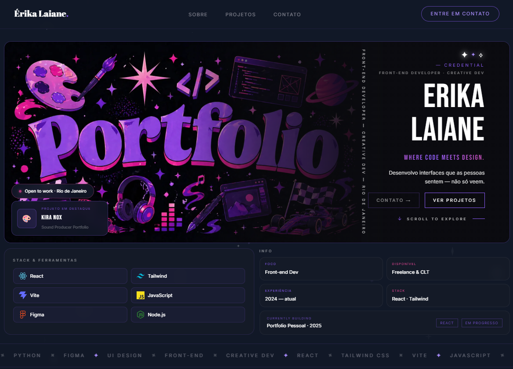

  

### 👩‍💻 Front-End Developer | UI/UX Focus  
Desenvolvendo interfaces que unem **design e código para criar experiências reais de usuário**

🔗 **Portfólio:** https://portfolio-erika-laiane.vercel.app/

 

  <em>✦ Explore o projeto completo</em>

  <strong>React • Tailwind • UI/UX • Responsivo</strong>

---

## ✨ O que eu entrego

- Interfaces modernas com foco em **experiência do usuário (UI/UX) e usabilidade**
- Conversão de layouts do Figma em código **fiel, responsivo e performático**
- Implementação de microinterações e refinamento visual para **melhor engajamento**
- Código front-end organizado, escalável e alinhado a boas práticas de mercado

---

## 💜 Sobre mim

Sou desenvolvedora front-end com foco em **interfaces visuais e experiência do usuário**, criando aplicações que equilibram **estética, usabilidade e performance**.  
Meu trabalho está na interseção entre **design e código**, criando interfaces que não só funcionam, mas **comunicam, engajam e geram experiência**.

Tenho experiência prática com **React, JavaScript e Tailwind CSS**, desenvolvendo aplicações e landing pages com atenção a:

- Hierarquia visual  
- Responsividade  
- Performance  
- Microinterações  

---

## 🚀 Stack principal

---

## 🎯 Projetos em destaque

### 🎵 Kira Nox — Sound Producer Portfolio  
Projeto focado em **identidade visual forte e experiência imersiva**, explorando glassmorphism, tipografia expressiva e animações para criar uma interface envolvente.

🔗 [Ver Projeto](https://github.com/erikalaiane/kira-nox)

---

### 🏎️ Acelera Club — Hub de Automobilismo  
Interface moderna inspirada no universo da Fórmula 1, com foco em hierarquia visual, contraste e organização de conteúdo.

🔗 [Ver Projeto](https://github.com/erikalaiane/acelera-club)  
🚀 [Ver Demo](https://erikalaiane.github.io/acelera-club/)

---

## 🚀 Vamos trabalhar juntos?

Estou em busca de uma oportunidade de estágio em front-end onde eu possa contribuir com interfaces bem construídas e evoluir tecnicamente.

---

## 📫 Contato

---

💡 *Interfaces bonitas chamam atenção. Interfaces bem construídas mantêm o usuário.*

